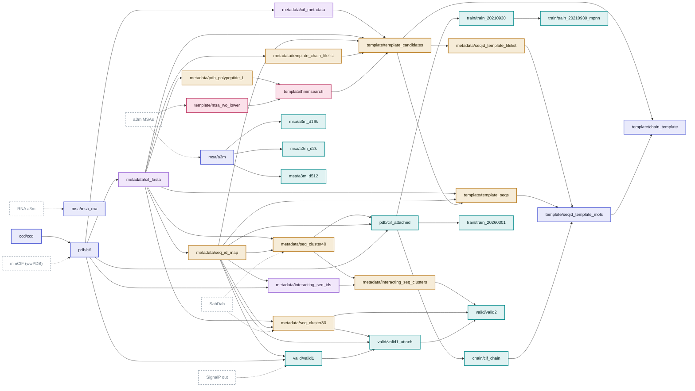
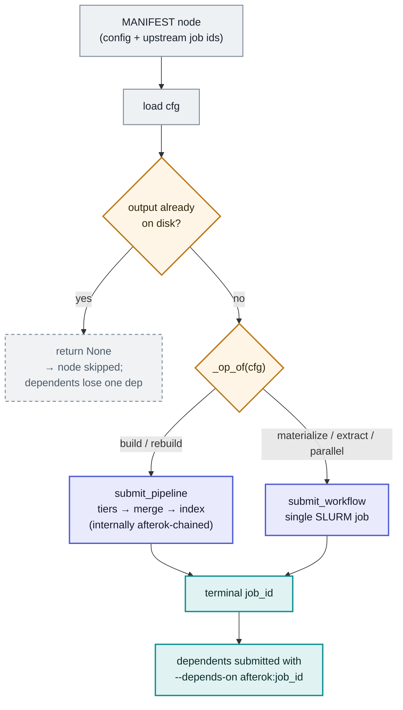

# `structcooker build-all` — the BioMol DAG

One command turns [`db/MANIFEST.yaml`](../db/MANIFEST.yaml) into a datacooker
meta-recipe: **31 database configs**, topologically sorted, each dispatched by the op
class `structcooker build` infers from its config, and SLURM-chained with `afterok` so a
node only starts once its upstreams exit 0. Already-built outputs are skipped.

> A styled, interactive version of these diagrams is published as an artifact:
> <https://claude.ai/code/artifact/99280998-fe04-4500-be9f-9746ad8ef299>
> (re-render from [`docs/build-all-dag.html`](build-all-dag.html) if it needs updating).

- **31** db nodes · **5** op classes · **3** deliverables · `afterok` chaining
- Source of truth: `db/MANIFEST.yaml` · op inference: `src/structcooker/cli.py:_op_of`
- Run `structcooker inspect` before `structcooker build-all`.

## 1. The dependency graph

Left → right is build order. Each node is colored by its op. Dashed grey nodes are
external raw inputs — **not** DAG nodes; they are fetched by `structcooker download` /
provided, and checked by `structcooker inspect`.

## 2. What happens to one node

build-all is itself a datacooker recipe: every node is a step
`name <- submit(*upstream_job_ids)`. The engine topo-sorts (catching cycles / unknown
deps), then threads each node's terminal job id into its dependents.

1. **Skip is native, not bolted on.** The "already built?" gate returns `None`, and
   datacooker's None-propagation drops that node from the run — its dependents simply see
   one fewer upstream job to wait on. No `--condition` flag, no special-casing.
2. **Op decides the executor.** `build`/`rebuild` go to the planning-first pipeline (Ray
   owns memory; tiers → merge → index, each afterok-chained). `materialize`/`extract`/
   `parallel` go to a single workflow job.
3. **SLURM enforces order.** Every node is submitted up front; `--depends-on afterok:<id>`
   makes the scheduler start a node only after its upstreams exit 0. A failing upstream
   cancels its dependents instead of feeding them garbage.

## 3. Op → executor → resources

The op class is inferred from which key the config sets (`_op_of`), and it also fixes the
SLURM footprint for workflow jobs; build/rebuild size themselves from the planning phase.

| Op | Trigger key | Executor | Mem (GB) | Cores | Count |
|----|-------------|----------|---------:|------:|------:|
| `build` | `env_path` | planning-first pipeline | self-sized | self-sized | 6 |
| `rebuild` | `old_env_path` | planning-first pipeline | self-sized | self-sized | 11 |
| `parallel` | `split_recipe_path` | `parallel-run` | 490 | 112 | 2 |
| `extract` | `db_path` + `output_data_path` | `extract-lmdb` | 200 | 32 | 3 |
| `materialize` | `output_data_path` | `workflow run` | 128 | 8 | 9 |

Two `build` nodes (`template/seqid_template_mols`, `template/chain_template`) are `keyed`
— sized by key count rather than byte size.
