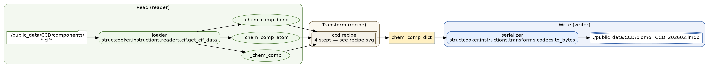
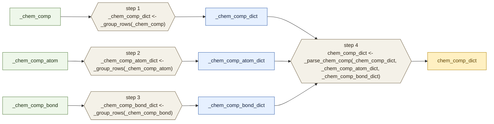

# CCD Ingest

Documentation for the **CCD ingest** workflow.

- Transform recipe: `structcooker.workflows.ingest.ccd` (`RECIPE`, `TARGETS`)
- Read / Write boundary: `configs/ingest/ccd_lmdb.yaml`

The recipe is the *Transform* layer only. The *Read* (loader) and *Write*
(serializer) boundaries come from the ingest config, not the recipe — both are
shown together in the pipeline diagram below.

## Pipeline (Read -> Transform -> Write)

Raw CCD `*.cif` files are loaded by `get_cif_data` into the three raw tables the
recipe consumes; the recipe produces `chem_comp_dict`; `to_bytes` serializes it
into the `biomol_CCD` LMDB.



| Boundary | Hook | Value |
|----------|------|-------|
| Read  | `loader`     | `structcooker.instructions.readers.cif.get_cif_data` |
| Write | `serializer` | `structcooker.instructions.transforms.codecs.to_bytes` |
| Source | files   | `/public_data/CCD/components/*.cif*` |
| Dest   | LMDB    | `/public_data/CCD/biomol_CCD_202602.lmdb` |

## Transform recipe (detail)


```text
Targets: chem_comp_dict
Required inputs: <none>
Execution order:
1. _chem_comp_dict <- _group_rows(_chem_comp)
2. _chem_comp_atom_dict <- _group_rows(_chem_comp_atom)
3. _chem_comp_bond_dict <- _group_rows(_chem_comp_bond)
4. chem_comp_dict <- _parse_chem_comp(_chem_comp_dict, _chem_comp_atom_dict, _chem_comp_bond_dict)
```

### Mermaid (transform recipe)



## Sources

- `sources/pipeline.dot` / `.svg` / `.png` — Read -> Transform -> Write
- `sources/recipe.dot` / `.svg` / `.png` — Transform recipe DAG
