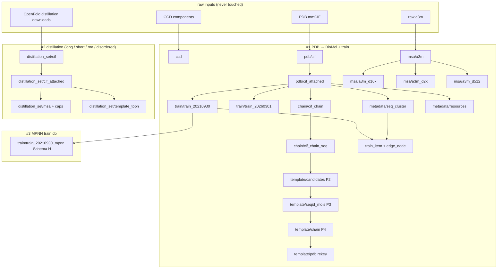

# StructCooker Rebuild Roadmap

Goal: a clean, publishable library that **reproduces the BioMol directory from raw
inputs** — every artifact built by one declarative config, on one engine, with no
legacy scripts or hand-written sbatch.

> The full 31-node build-all DAG and the per-node submit/skip/afterok mechanism are
> diagrammed in [docs/build-all.md](build-all.md). Before `pdb/cif`, 53 mmCIFs need a
> manual substitution — see [docs/manual-cif-fixes.md](manual-cif-fixes.md).

## Guiding principle

> **One artifact = one `db/*.yaml`, built by `structcooker build <name>` on the
> datacooker Ray engine.** No `configs/` legacy, no `scripts/` one-offs, no manual
> `sbatch`. A reader reproduces any BioMol DB by reading its config.

- **Test output → `/data/shared/cssb_data/BioMol_clean`.** The production tree
  `/data/shared/cssb_data/BioMol` is read-only for validation; its **raw inputs are
  never touched** (mmCIF, a3m, OpenFold downloads).
- Correctness bar: a reproduced DB is **decode-level deep-equal** to production
  (compression framing may differ; decoded content must match).

## Engine (foundation)

`libs/datacooker` — planning-first pipeline, **Ray-only fan-out** (measured
admission control, no predict-with-E OOM). Status: single-node Ray landed &
committed (`d37d826`). **In progress:** multi-node Ray cluster (global scheduling +
node-local shard writers → merge). The cluster engine also removes the **template
key-list sizing gap** (key-list builds need no input-`st_size` sizing once Ray
self-regulates memory), which is what currently blocks the 🔴 template rows.

## The full DAG



## Per-deliverable config inventory

Status: ✅ clean db config · 🔴 legacy/script, port to recipe+config · 🟡 multi-stage
DAG · ⏸️ deferred (code exists, build later) · ⬜ not started.

### #1 — PDB → BioMol + train

| config | op | schema | source | status |
|---|---|---|---|---|
| `ccd/ccd` | build | G | CCD component `.cif` | ✅ |
| `pdb/cif` | build | A | raw mmCIF | ✅ |
| `pdb/cif_attached` | rebuild | B | `cif` + metadata | ✅ |
| `train/train_20210930` | rebuild | B | `cif_attached` (release ≤ 2021-09-30) | ✅ |
| `train/train_20260301` | rebuild | B | `cif_attached` (release ≤ 2026-03-01) | ✅ |
| `msa/a3m` | build | E | raw a3m | ✅ |
| `msa/a3m_d16k` · `a3m_d2k` · `a3m_d512` | rebuild | E | `a3m` (depth cap) | ✅ |
| `chain/cif_chain` | build | — | `cif_attached` (split by chain) | 🔴 port |
| `chain/cif_chain_seq` | build | — | `cif_chain` (chain→seq_id) | 🔴 port |
| `template/candidates` (P2) | — | — | `cif_chain_seq` + search | 🔴 port |
| `template/seqid_mols` (P3) | build | — | candidates (items = seqids) | 🔴 port |
| `template/chain` (P4) | build | — | seqid_mols (items = chain keys) | 🔴 port |
| `template/pdb` | rekey | — | `template/chain` (UPPER→lower) | 🔴 port |
| `msa/msa_rna` | rebuild | E | rna a3m | 🔴 port |
| `metadata/seq_cluster` | — | — | `cif_attached` fasta (mmseqs/cd-hit) | 🟡 |
| `metadata/resources` | — | — | shard index for the loader | 🔴 port (was script) |
| `train_item` + `edge_node` | export | — | `train_*` + seq clusters | 🔴 port |
| `valid/valid1 → valid/valid2` | 2-stage | — | cross-set dedup vs train | 🟡 |

### #2 — Distillation (per set: long, short, rna, disordered)

Inputs live under `/data/shared/cssb_data/BioMol/materials/raw/openfold_distillation`
(`monomer_distillation_sets_v2/{long,short}_monomers`, `rna_distillation_set`,
`disordered_set`). All ⏸️ deferred today.

| config (× each set) | op | source | status |
|---|---|---|---|
| `distillation_{set}/cif` | build | OpenFold predicted structures | ⏸️ |
| `distillation_{set}/cif_attached` | rebuild | `cif` + metadata | ⏸️ |
| `distillation_{set}/msa` + caps (`d2k`/`d512`/`d5k`) | build/rebuild | OpenFold MSAs | ⏸️ |
| `distillation_{set}/template_topn` | build | per-set templates | ⏸️ |

### #3 — MPNN train db

| config | op | schema | source | status |
|---|---|---|---|---|
| `train/train_20210930_mpnn` | rebuild | H | `train_20210930` (1:N pruned CIFMol) | ✅ (validate + doc) |

## Target library structure

```
src/structcooker/
  instructions/{readers,transforms,writers}/   # transform primitives (KEEP)
  workflows/exports/*.py                        # datacooker RECIPE modules
  cli.py                                         # `structcooker build|list`
db/**/*.yaml                                     # THE public build interface (expand to all)
libs/datacooker/                                 # engine (Ray-only)
docs/                                            # mkdocs
```

Retire (out of the published package): `configs/` (legacy per-tier), one-off
`scripts/`/`submits/` (move canonical ones to `examples/`, gitignore scratch).

## Phased plan

- **Phase 0 — engine.** Finish the multi-node Ray cluster (global scheduling,
  shard→merge, cluster executor, planner reduced to node-count + even split).
  Unblocks the template key-list builds.
- **Phase 1 — #1 complete.** Port the 🔴 rows (chain, template P2–P4, msa_rna,
  resources, edge_node) to recipes + `db/` configs; declare `seq_cluster` and the
  `valid` 2-stage DAG. Outcome: the whole `pdb/`+`chain/`+`train/`+`metadata/` tree
  reproducible from `structcooker build`.
- **Phase 2 — #2 distillation.** A download/ingest workflow for the OpenFold sets +
  `distillation_*/` configs reusing the same cif/msa/template recipes.
- **Phase 3 — #3 mpnn.** Validate `train_20210930_mpnn` end-to-end; document the
  pruning view.
- **Phase 4 — publishable.** Retire legacy paths, scratch cleanup, docs/tutorials,
  a reproduction smoke test, and packaging (license + how external users obtain raw
  inputs — PDB/CCD/OpenFold fetchers, since they lack `/data/shared`).

## Open design decisions

1. **template key-list sizing** — resolved by the Ray cluster engine (memory is
   measured, so key-list builds need no input-size planning). Confirm on P3/P4.
2. **Distillation download automation** — script the OpenFold fetch, or assume
   pre-downloaded inputs? Affects whether external users can run #2.
3. **Public raw-input access** — the library must fetch PDB mmCIF + CCD + OpenFold
   for users without `/data/shared`; needed before "publishable."
4. **`chain/` and `template/` as 1:1 vs 1:N** — decide explode semantics per config.
