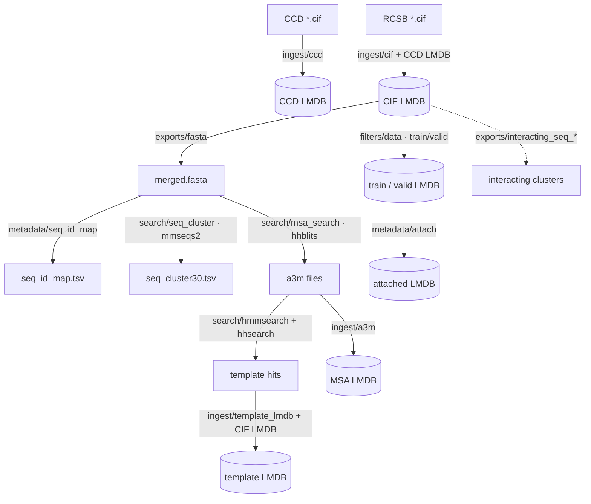

# Data flow

The StructCooker workflows compose into one end-to-end pipeline that turns raw
wwPDB / sequence data into the LMDB databases used downstream. Each box is a
workflow with its own [tutorial](tutorials.md); arrows are the artifacts they
produce and consume.

## Main flow

1. **CCD LMDB** — ingest the wwPDB Chemical Component Dictionary
   ([CCD ingest](tutorials/ingest-ccd.md)).
2. **CIF LMDB** — ingest RCSB mmCIF structures, resolving components against the
   CCD LMDB ([CIF ingest](tutorials/ingest-cif.md)).
3. **FASTA** — extract sequences from the CIF LMDB
   ([Exports](tutorials/exports.md)).
4. **Sequence id map** — assign stable sequence ids
   ([Metadata](tutorials/metadata.md)).
5. **Sequence clustering** — mmseqs2 clusters at 30 % identity
   ([Search](tutorials/search.md)).
6. **MSA search** — hhblits against UniRef30 + BFD
   ([Search](tutorials/search.md)).
7. **Template search** — hmmsearch / hhsearch over the MSAs
   ([Search](tutorials/search.md)).
8. **MSA LMDB** — pack the alignments, keyed by sequence id
   ([MSA ingest](tutorials/ingest-msa.md)).
9. **Template LMDB** — resolve template hits into `TemplateMol`s against the CIF
   LMDB, keyed by sequence id ([Template ingest](tutorials/ingest-template.md)).

## Optional flow

- **Filter** the dataset into train / valid splits
  ([Filters](tutorials/filters.md)).
- **Attach metadata** to the filtered structures
  ([Metadata](tutorials/metadata.md)).
- **Extract** interacting sequence ids / clusters and other artifacts
  ([Exports](tutorials/exports.md)).
- **Profile / validate** the resulting databases
  ([Analysis](tutorials/analysis.md)).

!!! note "Engine vs. domain"
    Every box above is a [DataCooker](https://CSSB-SNU.github.io/DataCooker/)
    recipe behind a config. The *engine* mechanics (recipes, `cli.lmdb`,
    `cli.workflow`) are documented in the DataCooker docs; these tutorials cover
    the *domain* recipes and how to run them.
