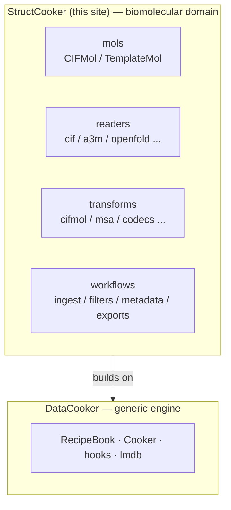

# StructCooker

StructCooker is a **biomolecular domain package built on top of
[DataCooker](https://CSSB-SNU.github.io/DataCooker/)**. DataCooker provides the
generic recipe engine (RecipeBook, the Cooker, hooks, and the LMDB workflows);
StructCooker adds everything specific to structures, sequences, and alignments.

!!! tip "Engine concepts live in the DataCooker docs"
    How recipes, targets, hooks, and LMDB builds work is documented once, in
    the [DataCooker docs](https://CSSB-SNU.github.io/DataCooker/). This site
    covers only the **domain layer** — the molecular objects, readers, and
    dataset recipes that StructCooker adds on top.

## Package layout

- `mols/` — BioMol-backed domain objects (`CIFMol`, `TemplateMol`).
- `instructions/readers/` — external loaders (mmCIF, a3m, OpenFold `.npz`, LMDB).
- `instructions/transforms/` — adapters, serializers, reusable transforms.
- `instructions/writers/` — output materializers.

## Workflow layout

- `workflows/ingest/` — LMDB build recipes (CIF, a3m, template, OpenFold).
- `workflows/filters/` — dataset filtering and cleanup.
- `workflows/metadata/` — metadata enrichment and export prep.
- `workflows/exports/` — downstream artifact extraction.
- `workflows/search/` — MSA, template, and clustering recipes.
- `workflows/analysis/` — validation and profiling.

## Next steps

- [Getting Started](getting-started.md) — install StructCooker (with DataCooker).
- [OpenFold3 distillation ingest](tutorials/openfold-distillation.md) — build
  MSA / structure / template LMDBs from the distillation datasets.
- Engine reference: [DataCooker docs](https://CSSB-SNU.github.io/DataCooker/).
