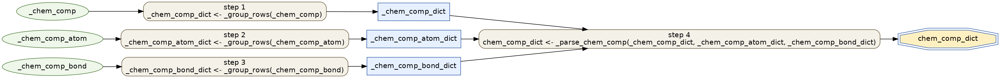
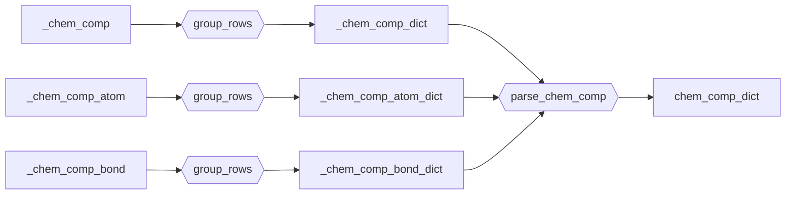

# CCD ingest

Ingest the wwPDB **Chemical Component Dictionary** (CCD) into an LMDB keyed by
component id. This is step 1 of the [data flow](../data-flow.md) — the CIF
ingest resolves residues/ligands against it.

- Recipe (Transform): `structcooker.workflows.ingest.ccd` (`chem_comp_dict`)
- Read/Write boundary: `configs/ingest/ccd_lmdb.yaml`

The recipe is the *Transform* layer only. The *Read* (loader) and *Write*
(serializer) boundaries come from the config, not the recipe — see the
[DataCooker LMDB guide](https://CSSB-SNU.github.io/DataCooker/tutorials/build_lmdb/)
for how those hooks work.

## Pipeline (Read → Transform → Write)

Raw CCD `*.cif` files are loaded by `get_cif_data` into the three raw tables the
recipe consumes; the recipe produces `chem_comp_dict`; `to_bytes` serializes it
into the CCD LMDB.


| Boundary | Hook | Value |
|----------|------|-------|
| Read  | `loader`     | `structcooker.instructions.readers.cif.get_cif_data` |
| Write | `serializer` | `structcooker.instructions.transforms.codecs.to_bytes` |
| Source | files   | CCD `components/*.cif*` |
| Dest   | LMDB    | `biomol_CCD_*.lmdb` |

## Transform recipe



```text
Targets: chem_comp_dict
Execution order:
1. _chem_comp_dict      <- _group_rows(_chem_comp)
2. _chem_comp_atom_dict <- _group_rows(_chem_comp_atom)
3. _chem_comp_bond_dict <- _group_rows(_chem_comp_bond)
4. chem_comp_dict       <- _parse_chem_comp(_chem_comp_dict, _chem_comp_atom_dict, _chem_comp_bond_dict)
```



## Run

```bash
sbatch submits/ingest/ccd_lmdb.sh
# or directly:
pixi run python -m datacooker.cli.lmdb build configs/ingest/ccd_lmdb.yaml --map-size 100000000000
```
