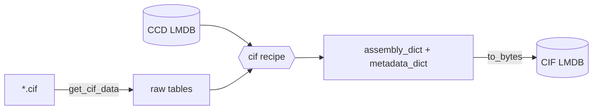

# CIF ingest

Ingest RCSB **mmCIF** structures into the core CIF LMDB. Each record is the
assembly graph (`assembly_dict`) plus `metadata_dict`, loadable as a
[`CIFMol`](../index.md). Components are resolved against the
[CCD LMDB](ingest-ccd.md).

- Recipe: `structcooker.workflows.ingest.cif` (`assembly_dict`, `metadata_dict`)
- Config: `configs/ingest/cif_lmdb.yaml`

| Boundary | Hook | Value |
|----------|------|-------|
| Read | `loader` | `structcooker.instructions.readers.cif.get_cif_data` |
| Read | `key_transform` | `structcooker.instructions.readers.cif.dot_transform` |
| Write | `serializer` | `structcooker.instructions.transforms.codecs.to_bytes` |
| Extra input | `ccd_db_path` | the CCD LMDB from the [previous step](ingest-ccd.md) |

The key is the PDB id (`dot_transform` handles the `.cif` suffix). The recipe
extracts metadata (`_entry.id`, resolution, deposition date), merges chemical
components, builds assemblies, and computes chain/length stats.



## Run

```bash
sbatch submits/ingest/cif_lmdb.sh
# sharded:
sbatch submits/ingest/cif_lmdb_shard.sh
# directly:
pixi run python -m datacooker.cli.lmdb build configs/ingest/cif_lmdb.yaml --map-size 2000000000000
```

!!! tip
    `n_jobs` is kept small in the config to avoid OOM on large assemblies; raise
    it only if memory allows. Builds are resumable (`skip_existing`) and
    shardable (`--shard-idx/--n-shards`), then merged with `cli.lmdb merge`.
