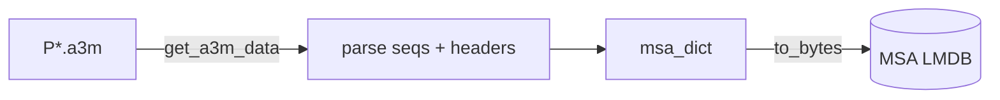

# MSA ingest

Pack per-sequence MSAs (a3m files from [MSA search](search.md)) into an LMDB
keyed by sequence id.

- Recipe: `structcooker.workflows.ingest.a3m` (`msa_dict`)
- Config: `configs/ingest/a3m_lmdb.yaml`

| Boundary | Hook | Value |
|----------|------|-------|
| Read | `loader` | `structcooker.instructions.readers.a3m.get_a3m_data` |
| Write | `serializer` | `structcooker.instructions.transforms.codecs.to_bytes` |
| Source | files | `P*.a3m` under the MSA directory |
| Dest | LMDB | `a3m.lmdb` |

The recipe parses sequences and headers and assembles a `msa_dict`
(`sequences` + `headers`). The LMDB key is the file stem (the sequence id).



## Run

```bash
sbatch submits/ingest/a3m_lmdb.sh
# directly:
pixi run python -m datacooker.cli.lmdb build configs/ingest/a3m_lmdb.yaml --map-size 2000000000000
```

!!! note "OpenFold distillation MSAs are different"
    The distillation datasets store preprocessed, already-aligned MSAs as
    `alignment.npz` (one or several sources per entry). Those use a dedicated
    reader/recipe — see [OpenFold3 distillation ingest](openfold-distillation.md).
