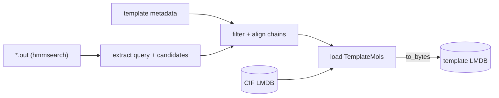

# Template ingest

Resolve template hits (hmmsearch output from [template search](search.md)) into
`TemplateMol` structures pulled from the [CIF LMDB](ingest-cif.md), keyed by
sequence id.

- Recipe: `structcooker.workflows.ingest.template_lmdb` (`template_mols`)
- Metadata recipe: `structcooker.workflows.metadata.load_template_metadata`
- Config: `configs/ingest/template_lmdb.yaml`

Unlike the other ingests, this one needs **two extra wirings** from the config:

- `metadata_recipe` + `metadata_input` — load template metadata (release dates,
  `seqid2seq`, clusters, signalp) once, shared across all entries.
- `inputs.cif_db_path` — the CIF LMDB the templates' coordinates are read from.

The recipe extracts query sequences from the hmmsearch output, filters and
aligns candidate template chains (date cutoff, length, top-k), then loads each
aligned chain as a `TemplateMol`.



## Run

```bash
sbatch submits/ingest/template_lmdb.sh
# directly:
pixi run python -m datacooker.cli.lmdb build configs/ingest/template_lmdb.yaml --map-size 2000000000000
```

!!! note "OpenFold distillation templates are different"
    The distillation `template.npz` already stores resolved template *hits*
    (`index` / `release_date` / `idx_map`) per entry — no CIF lookup needed.
    See [OpenFold3 distillation ingest](openfold-distillation.md).
