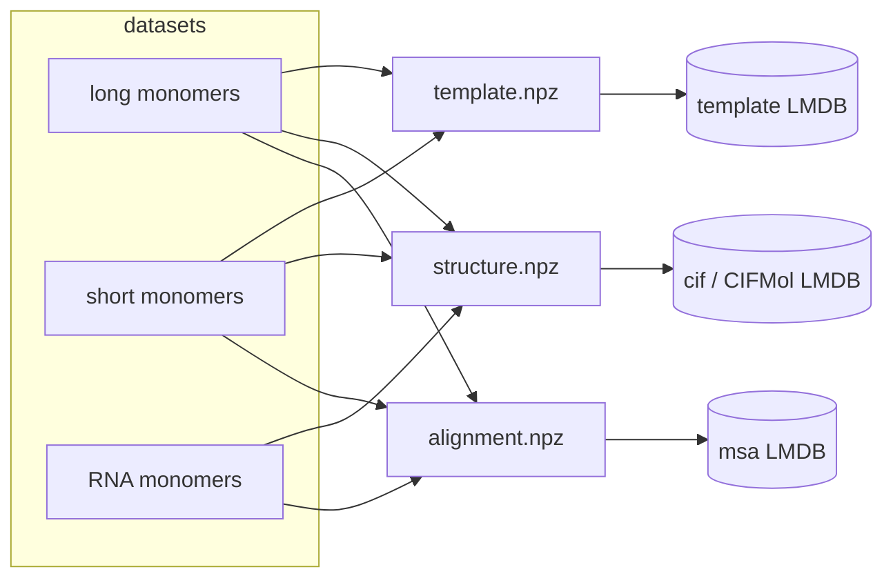

# OpenFold3 distillation ingest

The [OpenFold3 distillation datasets](https://portal.openfold.omsf.io/datasets)
store one folder per entry, each holding up to three `.npz` files:

```text
<dataset>/<entry_id>/alignment.npz    # MSA(s)
<dataset>/<entry_id>/structure.npz    # predicted 3D structure (flat atom table)
<dataset>/<entry_id>/template.npz     # template hits (protein only)
```

StructCooker ingests these into **three LMDBs** — MSA, structure (`CIFMol`), and
template — with **one reader / transform / writer set per data type**, shared
across all datasets.



!!! note "RNA has no templates"
    RNA monomers ship only `alignment.npz` and `structure.npz`, so the template
    LMDB is built for the protein (long/short) sets only.

## How it maps to DataCooker

Each LMDB is an ordinary [DataCooker LMDB
build](https://CSSB-SNU.github.io/DataCooker/tutorials/build_lmdb/): a loader
reads one `.npz`, a recipe normalises it, a serializer encodes it, and the
record is keyed per entry.

| Piece | Where |
| --- | --- |
| loaders | `instructions/readers/openfold.py` |
| MSA / template transforms | `instructions/transforms/openfold.py` |
| structure → `CIFMol` transform | `instructions/transforms/openfold_structure.py` |
| recipes | `workflows/ingest/openfold_{msa,structure,template}.py` |
| configs | `configs/ingest/openfold_{msa,structure,template}_{long,short,rna}.yaml` |
| submit scripts | `submits/ingest/openfold_{msa,structure,template}.sh` |

### Keys come from the folder, not the file

Every entry's file is named the same (`alignment.npz`, ...), so the LMDB key is
derived from the **parent folder** (the entry id) via a `key_builder`:

```python
# instructions/readers/openfold.py
def openfold_entry_key(path: Path) -> str:
    return path.parent.name
```

```yaml
# configs/ingest/openfold_msa_long.yaml
key_builder: structcooker.instructions.readers.openfold.openfold_entry_key
```

### One reader, every dataset

MSA payloads differ per dataset (protein monomers carry one source; RNA carries
`rnacentral_hits` / `nt_hits` / `rfam_hits`), so the reader returns *all*
sources uniformly and the transform keeps them keyed by source name — the same
code serves long, short, and RNA.

### Structure records are unified `CIFMol`s

`structure.npz` is a flat atom table. The structure transform rebuilds the
residue/chain hierarchy (`IndexTable.from_parents`) into a `CIFMol`, and
**materialises features the distillation output lacks** (`aromatic`, `stereo`,
`b_factor`, `formula`, `one_letter_code`, `entity_type`, ...) as empty fields so
the records share the schema of the existing `cif.lmdb` database.

## Running a build

```bash
# one dataset / data type (long monomers, MSA)
sbatch submits/ingest/openfold_msa.sh long

# or directly via the DataCooker CLI
pixi run python -m datacooker.cli.lmdb build \
    configs/ingest/openfold_structure_rna.yaml --map-size 2000000000000
```

Builds are resumable (`skip_existing`) and shardable (`--shard-idx/--n-shards`),
then merged with `datacooker.cli.lmdb merge`. See the
[DataCooker LMDB guide](https://CSSB-SNU.github.io/DataCooker/tutorials/build_lmdb/)
for the engine-side details.
